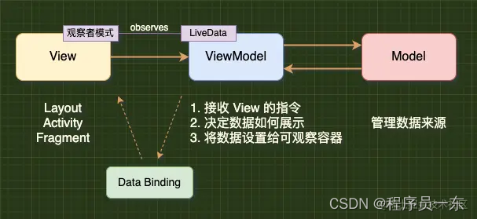
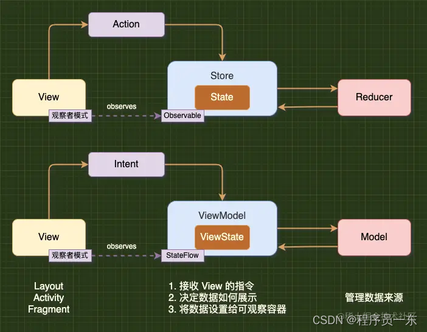
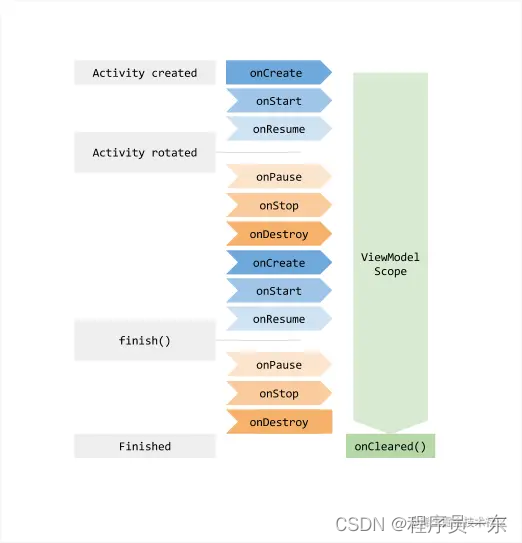
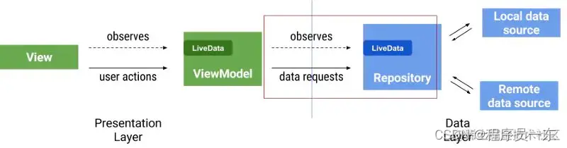
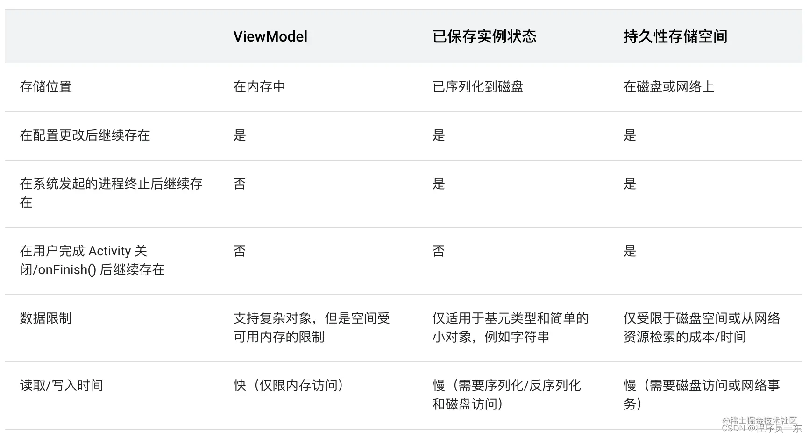

来源
作者：彭旭锐
链接：https://juejin.cn/post/7121998366103306254
### 前言

ViewModel 是 Jetpack 组件中较常用的组件之一，也是实现 MVVM 模式或 MVI 模式的标准组件之一。在这篇文章里，我将与你讨论 ViewModel 实用和面试常见的知识点。如果能帮上忙请务必点赞加关注，这对我非常重要。

这篇文章是 Jetpack 系列文章第 3 篇，专栏文章列表：

### 1. 认识 ViewModel

#### 1.1 为什么要使用 ViewModel？

ViewModel 的作用可以区分 2 个维度来理解：

- 1、界面控制器维度： 在最初的 MVC 模式中，Activity / Fragment 中承担的职责过重，因此，在后续的 UI 开发模式中，我们选择将 Activity / Fragment 中与视图无关的职责抽离出来，在 MVP 模式中叫作 Presenter，在 MVVM 模式中叫作 ViewModel。因此，我们使用 ViewModel 来承担界面控制器的职责，并且配合 LiveData / Flow 实现数据驱动。
- 2、数据维度： 由于 Activity 存在因配置变更销毁重建的机制，会造成 Activity 中的所有瞬态数据丢失，例如网络请求得到的用户信息、视频播放信息或者异步任务都会丢失。而 ViewModel 能够应对 Activity 因配置变更而重建的场景，在重建的过程中恢复 ViewModel 数据，从而降低用户体验受损。
  MVVM 模式示意图：


MVI 模式示意图：

ViewModel 生命周期示意图：


#### 1.2 ViewModel 的使用方法
##### 1、添加依赖： 在 build.gradle 中添加 ViewModel 依赖，需要注意区分过时的方式：

```java
    // 目前的方式：
    def lifecycle_version = "2.5.0"
    // Lifecycle 核心类
    implementation "androidx.lifecycle:lifecycle-runtime:$lifecycle_version"
    // LiveData
    implementation "androidx.lifecycle:lifecycle-livedata-ktx:$lifecycle_version"
    // ViewModel
    implementation "androidx.lifecycle:lifecycle-viewmodel-ktx:$lifecycle_version"
    // 过时方式（lifecycle-extensions 不再维护）
    implementation "androidx.lifecycle:lifecycle-extensions:2.4.0"
```


##### 2、模板代码： ViewModel 通常会搭配 LiveData 使用，以下为使用模板，相信大家都很熟悉了：

`NameViewModel.kt`
```java

class NameViewModel : ViewModel() {
val currentName: MutableLiveData<String> by lazy {
MutableLiveData<String>()
MainActivity.kt

class MainActivity : AppCompatActivity() {

    private val model: NameViewModel by viewModels()

    override fun onCreate(savedInstanceState: Bundle?) {
        super.onCreate(savedInstanceState)
        setContentView(R.layout.activity_main)

        // LiveData 观察者
        val nameObserver = Observer<String> { newName ->
            // 更新视图
            nameTextView.text = newName
        }

        // 注册 LiveData 观察者，this 为生命周期宿主
        model.currentName.observe(this, nameObserver)

        // 修改 LiveData 数据
        button.setOnClickListener {
            val anotherName = "John Doe"
            model.currentName.value = anotherName
        }
    }

}
```
#### 1.3 ViewModel 的创建方式
创建 ViewModel 实例的方式主要有 3 种，它们最终都是通过第 1 种 ViewModelProvider 完成的：

##### 方法 1： ViewModelProvider 是创建 ViewModel 的工具类：

示例程序
```java
// 不带工厂的创建方式
val vm = ViewModelProvider(this).get(MainViewModel::class.java)
// 带工厂的创建方式
val vmWithFactory = ViewModelProvider(this, MainViewModelFactory()).get(MainViewModel::class.java)

// ViewModel 工厂
class MainViewModelFactory(

) : ViewModelProvider.Factory {

    private val repository = MainRepository()

    override fun <T : ViewModel> create(modelClass: Class<T>): T {
        return MainViewModel(repository) as T
    }

}
```
##### 方法 2： 使用 Kotlin by 委托属性，本质上是间接使用了 ViewModelProvider：

示例程序
```java
// 在 Activity 中使用
class MainActivity : AppCompatActivity() {
// 使用 Activity 的作用域
private val viewModel : MainViewModel by viewModels()
}

// 在 Fragment 中使用
class MainFragment : Fragment() {
// 使用 Activity 的作用域，与 MainActivity 使用同一个对象
val activityViewModel : MainViewModel by activityViewModels()
// 使用 Fragment 的作用域
val viewModel : MainViewModel by viewModels()
}
```
##### 方法 3： Hilt 提供了注入部分 Jetpack 架构组件的支持

示例程序
```java

@HiltAndroidApp
class DemoApplication : Application() { ... }

@HiltViewModel
class MainViewModel @Inject constructor() : ViewModel() {
...
}

@AndroidEntryPoint
class MainHiltActivity : AppCompatActivity(){
val viewModel by viewModels<MainViewModel>()
...
}
```
依赖项
```java
// Hilt ViewModel 支持
implementation "androidx.hilt:hilt-lifecycle-viewmodel:1.0.0"
// Hilt 注解处理器
kapt "androidx.hilt:hilt-compiler:1.0.0"
```
需要注意的是，虽然可以使用依赖注入普通对象的方式注入 ViewModel，但是这相当于绕过了 ViewModelProvider 来创建 ViewModel。这意味着 ViewModel 实例一定不会存放在 ViewModelStore 中，将失去 ViewModel 恢复界面数据的特性。
错误示例
```java
@AndroidEntryPoint
class MainHiltActivity : AppCompatActivity(){
@Inject
lateinit var viewModel : MainViewModel
}
```
### 2. ViewModel 实现原理分析
#### 2.1 ViewModel 的创建过程
上一节提到，3 种创建 ViewModel 实例的方法最终都是通过 ViewModelProvider 完成的。ViewModelProvider 可以理解为创建 ViewModel 的工具类，它需要 2 个参数：

参数 1 ViewModelStoreOwner： 它对应于 Activity / Fragment 等持有 ViewModel 的宿主，它们内部通过 ViewModelStore 维持一个 ViewModel 的映射表，ViewModelStore 是实现 ViewModel 作用域和数据恢复的关键；
参数 2 Factory： 它对应于 ViewModel 的创建工厂，缺省时将使用默认的 NewInstanceFactory 工厂来反射创建 ViewModel 实例。
创建 ViewModelProvider 工具类后，你将通过 get() 方法来创建 ViewModel 的实例。get() 方法内部首先会通过 ViewModel 的全限定类名从映射表（ViewModelStore）中取缓存，未命中才会通过 ViewModel 工厂创建实例再缓存到映射表中。

正因为同一个 ViewModel 宿主使用的是同一个 ViewModelStore 映射表，因此在同一个宿主上重复调用 ViewModelProvider#get() 返回同一个 ViewModel 实例。

ViewModelProvider.java
```JAVA
// ViewModel 创建工厂
private final Factory mFactory;
// ViewModel 存储容器
private final ViewModelStore mViewModelStore;

// 默认使用 NewInstanceFactory 反射创建 ViewModel
public ViewModelProvider(ViewModelStoreOwner owner) {
this(owner.getViewModelStore(), ... NewInstanceFactory.getInstance());
}

// 自定义 ViewModel 创建工厂
public ViewModelProvider(ViewModelStoreOwner owner, Factory factory) {
this(owner.getViewModelStore(), factory);
}

// 记录宿主的 ViewModelStore 和 ViewModel 工厂
public ViewModelProvider(ViewModelStore store, Factory factory) {
mFactory = factory;
mViewModelStore = store;
}

@NonNull
@MainThread
public <T extends ViewModel> T get(Class<T> modelClass) {
String canonicalName = modelClass.getCanonicalName();
if (canonicalName == null) {
throw new IllegalArgumentException("Local and anonymous classes can not be ViewModels");
}
// 使用类名作为缓存的 KEY
return get(DEFAULT_KEY + ":" + canonicalName, modelClass);
}

// Fragment
@NonNull
@MainThread
public <T extends ViewModel> T get(String key, Class<T> modelClass) {
// 1. 先从 ViewModelStore 中取缓存
ViewModel viewModel = mViewModelStore.get(key);
if (modelClass.isInstance(viewModel)) {
return (T) viewModel;
}
// 2. 使用 ViewModel 工厂创建实例
viewModel = mFactory.create(modelClass);
...
// 3. 存储到 ViewModelStore
mViewModelStore.put(key, viewModel);
return (T) viewModel;
}

// 默认的 ViewModel 工厂
public static class NewInstanceFactory implements Factory {

    private static NewInstanceFactory sInstance;

    @NonNull
    static NewInstanceFactory getInstance() {
        if (sInstance == null) {
            sInstance = new NewInstanceFactory();
        }
        return sInstance;
    }

    @NonNull
    @Override
    public <T extends ViewModel> T create(Class<T> modelClass) {
        // 反射创建 ViewModel 对象
        return modelClass.newInstance();
    }

}
```
```JAVA
ViewModelStore.java

// ViewModel 本质上就是一个映射表而已
public class ViewModelStore {
// <String - ViewModel> 哈希表
private final HashMap<String, ViewModel> mMap = new HashMap<>();

    final void put(String key, ViewModel viewModel) {
        ViewModel oldViewModel = mMap.put(key, viewModel);
        if (oldViewModel != null) {
            oldViewModel.onCleared();
        }
    }

    final ViewModel get(String key) {
        return mMap.get(key);
    }

    Set<String> keys() {
        return new HashSet<>(mMap.keySet());
    }

    public final void clear() {
        for (ViewModel vm : mMap.values()) {
            vm.clear();
        }
        mMap.clear();
    }

}
```
ViewModel 宿主是 ViewModelStoreOwner 接口的实现类，例如 Activity：
ViewModelStoreOwner.java
```JAVA
public interface ViewModelStoreOwner {
@NonNull
ViewModelStore getViewModelStore();
}
```
androidx.activity.ComponentActivity.java
```JAVA
public class ComponentActivity extends androidx.core.app.ComponentActivity implements
ContextAware,
LifecycleOwner,
ViewModelStoreOwner ... {
// ViewModel 的存储容器
private ViewModelStore mViewModelStore;
// ViewModel 的创建工厂
private ViewModelProvider.Factory mDefaultFactory;

    @NonNull
    @Override
    public ViewModelStore getViewModelStore() {
        if (mViewModelStore == null) {
            // 已简化，后文补全
            mViewModelStore = new ViewModelStore();
        }
        return mViewModelStore;
    }

}
```
#### 2.2 by viewModels() 实现原理分析
by 关键字是 Kotlin 的委托属性，内部也是通过 ViewModelProvider 来创建 ViewModel。关于 Kotlin 委托属性的更多内容，我们在 Kotlin | 委托机制 & 原理 & 应用 这篇文章讨论过，这里不重复。

ActivityViewModelLazy.kt
```JAVA
@MainThread
public inline fun <reified VM : ViewModel> ComponentActivity.viewModels(
noinline factoryProducer: (() -> Factory)? = null
): Lazy<VM> {
val factoryPromise = factoryProducer ?: {
defaultViewModelProviderFactory
}

    return ViewModelLazy(VM::class, { viewModelStore }, factoryPromise)

}
```

ViewModelLazy.kt
```JAVA
public class ViewModelLazy<VM : ViewModel> (
private val viewModelClass: KClass<VM>,
private val storeProducer: () -> ViewModelStore,
private val factoryProducer: () -> ViewModelProvider.Factory
) : Lazy<VM> {
private var cached: VM? = null

    override val value: VM
        get() {
            val viewModel = cached
            return if (viewModel == null) {
                val factory = factoryProducer()
                val store = storeProducer()
                // 最终也是通过 ViewModelProvider 创建 ViewModel 实例
                ViewModelProvider(store, factory).get(viewModelClass.java).also {
                    cached = it
                }
            } else {
                viewModel
            }
        }

    override fun isInitialized(): Boolean = cached != null

}
```

#### 2.3 ViewModel 如何实现不同的作用域
ViewModel 内部会为不同的 ViewModel 宿主分配不同的 ViewModelStore 映射表，不同宿主是从不同的数据源来获取 ViewModel 的实例，因而得以区分作用域。

具体来说，在使用 ViewModelProvider 时，我们需要传入一个 ViewModelStoreOwner 宿主接口，它将在 getViewModelStore() 接口方法中返回一个 ViewModelStore 实例。

-   对于 Activity 来说，ViewModelStore 实例是直接存储在 Activity 的成员变量中的；
-   对于 Fragment 来说，ViewModelStore 实例是间接存储在 FragmentManagerViewModel 中的 <Fragment - ViewModelStore> 映射表中的。
这样就实现了不同的 Activity 或 Fragment 分别对应不同的 ViewModelStore 实例，进而区分不同作用域。

androidx.activity.ComponentActivity.java
```JAVA
public class ComponentActivity extends androidx.core.app.ComponentActivity implements
ContextAware,
LifecycleOwner,
ViewModelStoreOwner ... {

        @NonNull
        @Override
        public ViewModelStore getViewModelStore() {
            if (mViewModelStore == null) {
                // 已简化，后文补全
                mViewModelStore = new ViewModelStore();
            }
            return mViewModelStore;
        }

}
```

Fragment.java
```JAVA
@NonNull
@Override
public ViewModelStore getViewModelStore() {
// 最终调用 FragmentManagerViewModel#getViewModelStore(Fragment)
return mFragmentManager.getViewModelStore(this);
}
```
FragmentManagerViewModel.java
```JAVA
// <Fragment - ViewModelStore> 映射表
private final HashMap<String, ViewModelStore> mViewModelStores = new HashMap<>();

@NonNull
ViewModelStore getViewModelStore(@NonNull Fragment f) {
ViewModelStore viewModelStore = mViewModelStores.get(f.mWho);
if (viewModelStore == null) {
viewModelStore = new ViewModelStore();
mViewModelStores.put(f.mWho, viewModelStore);
}
return viewModelStore;
}
```

#### 2.4 为什么 Activity 在屏幕旋转重建后可以恢复 ViewModel？
ViewModel 底层是基于原生 Activity 因设备配置变更重建时恢复数据的机制实现的，这个其实跟 Fragment#setRetainInstance(true) 持久 Fragment 的机制是相同的。当 Activity 因配置变更而重建时，我们可以将页面上的数据或状态可以定义为 2 类：

-   第 1 类 - 配置数据： 例如窗口大小、多语言字符、多主题资源等，当设备配置变更时，需要根据最新的配置重新读取新的数据，因此这部分数据在配置变更后便失去意义，自然也就没有存在的价值；
-   第 2 类 - 非配置数据： 例如用户信息、视频播放信息、异步任务等非配置相关数据，这些数据跟设备配置没有一点关系，如果在重建 Activity 的过程中丢失，不仅没有必要，而且会损失用户体验（无法快速恢复页面数据，或者丢失页面进度）。
基于以上考虑，Activity 是支持在设备配置变更重建时恢复 第 2 类 - 非配置数据 的，源码中存在 NonConfiguration 字眼的代码，就是与这个机制相关的代码。我将整个过程大概可以概括为 3 个阶段：

-   阶段 1： 系统在处理 Activity 因配置变更而重建时，会先调用 retainNonConfigurationInstances 获取旧 Activity 中的数据，其中包含 ViewModelStore 实例，而这一份数据会临时存储在当前 Activity 的 ActivityClientRecord（属于当前进程，下文说明）；
-   阶段 2： 在新 Activity 重建后，系统通过在 Activity#onAttach(…) 中将这一份数据传递到新的 Activity 中；
-   阶段 3： Activity 在构造 ViewModelStore 时，会优先从旧 Activity 传递过来的这份数据中获取，为空才会创建新的 ViewModelStore。
对于 ViewModel 来说，相当于旧 Activity 中所有的 ViewModel 映射表被透明地传递到重建后新的 Activity 中，这就实现了恢复 ViewModel 的功能。总结一下重建前后的实例变化，帮助你理解:

-   Activity： 构造新的实例；
-   ViewModelStore： 保留旧的实例；
-   ViewModel： 保留旧的实例（因为 ViewModel 存储在 ViewModelStore 映射表中）；
-   LiveData： 保留旧的实例（因为 LiveData 是 ViewModel 的成员变量）；
现在，我们逐一分析这 3 个阶段的源码执行过程：
##### 阶段 1 源码分析：
Activity.java
```JAVA
// 阶段 1：获取 Activity 的非配置相关数据
NonConfigurationInstances retainNonConfigurationInstances() {
// 1.1 构造 Activity 级别的非配置数据
Object activity = onRetainNonConfigurationInstance();
// 1.2 构造 Fragment 级别的费配置数据数据
FragmentManagerNonConfig fragments = mFragments.retainNestedNonConfig();
    ...

    // 1.3 构造并返回 NonConfigurationInstances 非配置相关数据类
    NonConfigurationInstances nci = new NonConfigurationInstances();

    nci.activity = activity;
    nci.fragments = fragments;
    	...
    return nci;

}

// 1.1 默认返回 null，由 Activity 子类定义
public Object onRetainNonConfigurationInstance() {
return null;
}
```
androidx.activity.ComponentActivity.java
```JAVA
private ViewModelStore mViewModelStore;

// 1.1 ComponentActivity 在 onRetainNonConfigurationInstance() 中写入了 ViewModelStore
@Override
@Nullable
public final Object onRetainNonConfigurationInstance() {
ViewModelStore viewModelStore = mViewModelStore;
// 这一个 if 语句是处理异常边界情况：
// 如果重建的 Activity 没有调用 getViewModelStore()，那么旧的 Activity 中的 ViewModel 并没有被取出来，
// 因此在准备再一次存储当前 Activity 时，需要检查一下旧 Activity 传过来的数据。
if (viewModelStore == null) {
NonConfigurationInstances nc = (NonConfigurationInstances) getLastNonConfigurationInstance();
if (nc != null) {
viewModelStore = nc.viewModelStore;
}
}
// ViewModelStore 为空说明当前 Activity 和旧 Activity 都没有 ViewModel，没必要存储和恢复
if (viewModelStore == null) {
return null;
}
NonConfigurationInstances nci = new NonConfigurationInstances();
// 保存 ViewModelStore 对象
nci.viewModelStore = viewModelStore;
return nci;
}
```

ActivityThread.java
// Framework 调用 retainNonConfigurationInstances() 获取非配置数据后，
// 会通过当前进程内存临时存储这一份数据，这部分源码我们暂且放到一边。
##### 阶段 2 源码分析：
Activity.java
```JAVA
// 阶段 2：在 Activity#attach() 中传递旧 Activity 的数据
NonConfigurationInstances mLastNonConfigurationInstances;

final void attach(Context context, ActivityThread aThread,
...
NonConfigurationInstances lastNonConfigurationInstances) {
...
mLastNonConfigurationInstances = lastNonConfigurationInstances;
...
}
```

至此，旧 Activity 的数据就传递到新 Activity 的成员变量 mLastNonConfigurationInstances 中。

#### 阶段 3 源码分析：
androidx.activity.ComponentActivity.java
```JAVA
public class ComponentActivity extends androidx.core.app.ComponentActivity implements
ContextAware,
LifecycleOwner,
ViewModelStoreOwner ... {
private ViewModelStore mViewModelStore;
private ViewModelProvider.Factory mDefaultFactory;

    // 阶段 3：Activity 的 ViewModelStore 优先使用旧 Activity 传递过来的 ViewModelStore
    @NonNull
    @Override
    public ViewModelStore getViewModelStore() {
        if (mViewModelStore == null) {
            // 3.1 优先使用旧 Activity 传递过来的 ViewModelStore
            NonConfigurationInstances nc = (NonConfigurationInstances) getLastNonConfigurationInstance();
            if (nc != null) {
                mViewModelStore = nc.viewModelStore;
            }
            // 3.2 否则创建新的 ViewModelStore
            if (mViewModelStore == null) {
                mViewModelStore = new ViewModelStore();
            }
        }
        return mViewModelStore;
    }

}
```

Activity.java
```JAVA
// 这个变量在阶段 2 赋值
NonConfigurationInstances mLastNonConfigurationInstances;

// 返回从 attach() 中传递过来的旧 Activity 数据
public Object getLastNonConfigurationInstance() {
return mLastNonConfigurationInstances != null ? mLastNonConfigurationInstances.activity : null;
}
```
至此，就完成 ViewModel 数据恢复了。

现在，我们回过头来分析下 ActivityThread 这一部分源码：
ActivityThread 中的调用过程：
在 Activity 因配置变更而重建时，系统将执行 Relaunch 重建过程。系统在这个过程中通过同一个 ActivityClientRecord 来完成信息传递，会销毁当前 Activity，紧接着再马上重建同一个 Activity。

-   阶段 1： 在处理 Destroy 逻辑时，调用 Activity#retainNonConfigurationInstances() 方法获取旧 Activity 中的非配置数据，并临时保存在 ActivityClientRecord 中；
-   阶段 2： 在处理 Launch 逻辑时，调用 Activity#attach(…) 将 ActivityClientRecord 中临时保存的非配置数据传递到新 Activity 中。
ActivityThread.java
```JAVA
private void handleRelaunchActivityInner(ActivityClientRecord r, ...) {
final Intent customIntent = r.activity.mIntent;
// 处理 onPause()
performPauseActivity(r, false, reason, null /_ pendingActions _/);
// 处理 onStop()
callActivityOnStop(r, true /_ saveState _/, reason);
// 阶段 1：获取 Activity 的非配置相关数据
handleDestroyActivity(r.token, false, configChanges, true, reason);

    // 至此，Activity 中的 第 2 类 - 非配置数据就记录在 ActivityClientRecord 中，
    // 并通过同一个 ActivityClientRecord 重建一个新的 Activity

    // 阶段 2：在 Activity#attach() 中传递旧 Activity 的数据
    handleLaunchActivity(r, pendingActions, customIntent);

    // 至此，旧 Activity 中的非配置数据已传递到新 Activity

}

public void handleDestroyActivity(IBinder token, boolean finishing, int configChanges, boolean getNonConfigInstance, String reason) {
ActivityClientRecord r = performDestroyActivity(token, finishing, configChanges, getNonConfigInstance, reason);
...
if (finishing) {
ActivityTaskManager.getService().activityDestroyed(token);
}
}
```
```JAVA
// 阶段 1：获取 Activity 的非配置相关数据
// 参数 finishing 为 false
// 参数 getNonConfigInstance 为 true
ActivityClientRecord performDestroyActivity(IBinder token, boolean finishing, int configChanges, boolean getNonConfigInstance, String reason) {
ActivityClientRecord r = mActivities.get(token);
// 保存非配置数据，调用了阶段 1 中提到的 retainNonConfigurationInstances() 方法
if (getNonConfigInstance) {
r.lastNonConfigurationInstances = r.activity.retainNonConfigurationInstances();
}
// 执行 onDestroy()
mInstrumentation.callActivityOnDestroy(r.activity);
return r;
}

public Activity handleLaunchActivity(ActivityClientRecord r, PendingTransactionActions pendingActions, Intent customIntent) {
final Activity a = performLaunchActivity(r, customIntent);
}

// 阶段 2：在 Activity#attach() 中传递旧 Activity 的数据
private Activity performLaunchActivity(ActivityClientRecord r, Intent customIntent) {
// 创建新的 Activity 实例
Activity activity = mInstrumentation.newActivity(cl, component.getClassName(), r.intent);
// 创建或获取 Application 实例，在这个场景里是获取
Application app = r.packageInfo.makeApplication(false, mInstrumentation);
// 传递 lastNonConfigurationInstances 数据
activity.attach(appContext, ..., r.lastNonConfigurationInstances,...);
// 清空临时变量
r.lastNonConfigurationInstances = null;
...
}
```

#### 2.5 ViewModel 的数据在什么时候才会清除
ViewModel 的数据会在 Activity 非配置变更触发的销毁时清除，具体分为 3 种情况：

-   第 1 种： 直接调用 Activity#finish() 或返回键等间接方式；
-   第 2 种： 异常退出 Activity，例如内存不足；
-   第 3 种： 强制退出应用。
-   第 3 种没有给予系统或应用存储数据的时机，内存中的数据自然都会被清除。而前 2 种情况都属于非配置变更触发的，在 Activity 中存在 1 个 Lifecycle 监听：当 Activity 进入 DESTROYED 状态时，如果 Activity 不处于配置变更重建的阶段，将调用 ViewModelStore#clear() 清除 ViewModel 数据。

androidx.activity.ComponentActivity.java
```JAVA
public class ComponentActivity extends androidx.core.app.ComponentActivity implements
ContextAware,
LifecycleOwner,
ViewModelStoreOwner ... {
private ViewModelStore mViewModelStore;
private ViewModelProvider.Factory mDefaultFactory;

    public ComponentActivity() {
        // DESTROYED 状态监听
        getLifecycle().addObserver(new LifecycleEventObserver() {
            @Override
            public void onStateChanged(LifecycleOwner source, Lifecycle.Event event) {
                if (event == Lifecycle.Event.ON_DESTROY) {
                    mContextAwareHelper.clearAvailableContext();
                    // 是否处于配置变更引起的重建
                    if (!isChangingConfigurations()) {
                        getViewModelStore().clear();
                    }
                }
            }
        });
    }

}
```

Activity.java
```java
boolean mChangingConfigurations = false;

public boolean isChangingConfigurations() {
return mChangingConfigurations;
}
```
#### 3. ViewModel 的内存泄漏问题
ViewModel 的内存泄漏是指 Activity 已经销毁，但是 ViewModel 却被其他组件引用。这往往是因为数据层是通过回调监听器的方式返回数据，并且数据层是单例对象或者属于全局生命周期，所以导致 Activity 销毁了，但是数据层依然间接持有 ViewModel 的引用。
如果 ViewModel 是轻量级的或者可以保证数据层操作快速完成，这个泄漏影响不大可以忽略。但如果数据层操作并不能快速完成，或者 ViewModel 存储了重量级数据，就有必要采取措施。例如：

-   方法 1： 在 ViewModel#onCleared() 中通知数据层丢弃对 ViewModel 回调监听器的引用；
-   方法 2： 在数据层使用对 ViewModel 回调监听器的弱引用（这要求 ViewModel 必须持有回调监听器的强引用，而不能使用匿名内部类，这会带来编码复杂性）；
-   方法 3： 使用 EventBus 代替回调监听器（这会带来编码复杂性）；
-   方法 4： 使用 LiveData 的 Transformations.switchMap() API 包装数据层的请求方法，这相当于在 ViewModel 和数据层中间使用 LiveData 进行通信。例如：
MyViewModel.java
```java
// 用户 ID LiveData
MutableLiveData userIdLiveData = new MutableLiveData<String>();

// 用户数据 LiveData
LiveData userLiveData = Transformations.switchMap(userIdLiveData, id ->
// 调用数据层 API
repository.getUserById(id));

// 设置用户 ID
// 每次的 userIdLiveData 的值发生变化，repository.getUserById(id) 将被调用，并将结果设置到 userLiveData 上
public void setUserId(String userId) {
this.userIdLiveData.setValue(userId);

```

#### 4. ViewModel 和 onSaveInstanceState() 的对比
   ViewModel 和 onSaveInstanceState() 都是对数据的恢复机制，但由于它们针对的场景不同，导致它们的实现原理不同，进而优缺点也不同。

1、ViewModel： 使用场景针对于配置变更重建中非配置数据的恢复，由于内存是可以满足这种存储需求的，因此可以选择内存存储。又由于内存空间相对较大，因此可以存储大数据，但会受到内存空间限制；
2、onSaveInstanceState() ：使用场景针对于应用被系统回收后重建时对数据的恢复，由于应用进程在这个过程中会消亡，因此不能选择内存存储而只能选择使用持久化存储。又由于这部分数据需要通过 Bundle 机制在应用进程和 AMS 服务之间传递，因此会受到 Binder 事务缓冲区大小限制，只可以存储小规模数据。
如果是正常的 Activity 退出，例如返回键或者 finish()，都不属于 ViewModel 和 onSaveInstanceState() 的应用场景，因此都不会存储和恢复数据。




