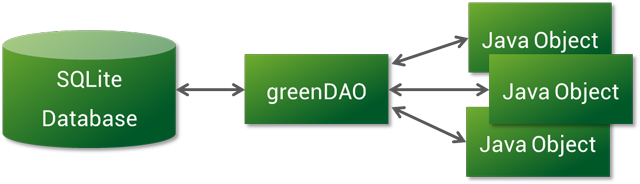

##  什么是GreenDAO
    GreenDAO是一个开源的Android ORM(“对象/关系映射”)，
    通过ORM（称为“对象/关系映射”），在我们数据库开发过程中节省了开发时间！
    通过GreenDao，我们可以更快速的操作数据库，我们可以使用简单的面相对象的API来存储，更新，删除和查询Java对象。
  

##  使用步骤
######  引用
- 导入插件
      // 在 Project的build.gradle 文件中添加:
      buildscript {
        repositories {
            jcenter()
            mavenCentral() // add repository
          }

        dependencies {
            classpath 'com.android.tools.build:gradle:3.1.2'  
            classpath 'org.greenrobot:greendao-gradle-plugin:3.2.2'
            // add plugin，用于配合gradle插件，用于快捷开发
            eg:修改实体后，构建后免升级数据库，可以直接修改数据库的属性
            eg:新增实体时发现问题，实现Serializable接口的实体 需要加上serialVersionUID常量
            ，否则不能自动生成新的数据库的映射字段
          }

- 配置相关依赖
      // 在 Moudle:app的  build.gradle 文件中添加:
      apply plugin: 'com.android.application'
      apply plugin: 'org.greenrobot.greendao' // apply plugin

      dependencies {
          implementation 'org.greenrobot:greendao:3.2.2' // add library
      }

- 配置数据库相关信息
      //位置build.gradle-->android内
      //可以选择配置或者不配置
      greendao {
          schemaVersion 1 //数据库版本号
          daoPackage 'com.aserbao.aserbaosandroid.functions.database.greenDao.db'
          // 设置DaoMaster、DaoSession、Dao 包名
          targetGenDir 'src/main/java'//设置DaoMaster、DaoSession、Dao目录
          generateTests false //设置为true以自动生成单元测试。
          targetGenDirTests 'src/main/java' //应存储生成的单元测试的基本目录。默认为 src / androidTest / java。
      }

- 通过配置以上信息后，rebuild项目，会自动生成DaoMaster&DaoSession类。

######  开发
- 创建一个实体类，并且在类上加上注释@Entity
      @Entity()
      public class Student {

          @Id
          private Long id;
          private String studentName;

      }

- 接下就会在你配置的daoPackage文件路径下，会出现三个类，DaoMaster、DaoSession、XXDao
  - DaoMaster: 用于管理数据库对象 并管理特定模式的DAO类（而不是对象）。
      它有静态方法来创建表或删除它们。
      它的内部类OpenHelper和DevOpenHelper是SQLiteOpenHelper实现，
      它们在SQLite数据库中创建模式。

  - DaoSession:管理特定模式的所有可用DAO对象，您可以使用其中一个getter方法获取该对象。
      DaoSession还提供了一些通用的持久性方法，如实体的插入，加载，更新，刷新和删除。

  - XXDao: 数据访问对象（DAO）持久存在并查询实体。对于每个实体，greenDAO生成DAO。
      它具有比DaoSession更多的持久性方法，例如：count，loadAll和insertInTx。

- 做完上面配置后，并成功生成三个类，你离成功使用就剩一半了，接下来进行初始化数据库(可以在myAppliation里面)
      //初始化GreenDao,直接在Application中进行初始化操作
      private void initGreenDao() {
          //创建数据库
          DaoMaster.DevOpenHelper helper = new DaoMaster.DevOpenHelper(this, "aserbao.db");
          SQLiteDatabase db = helper.getWritableDatabase();
          DaoMaster daoMaster = new DaoMaster(db);
          daoSession = daoMaster.newSession();
      }

      private DaoSession daoSession;
      public DaoSession getDaoSession() {
        return daoSession;
      }

######  增删改查
- 增
      //插入数据
      daoSession.insert(bean);
      //insertOrReplace()数据存在则替换，数据不存在则插入
      daoSession.insertOrReplace(bean);
- 删
      //删除
      daoSession.delete(bean);
      //删除全部(整张表)
       daoSession.deleteAll(Student.class);
- 改
      //修改
      //只要指定好实体里面的自增键，就可以根据ID进行修改,不一定非要传实体
      daoSession.update(s);
- 查
      //loadAll()查询所有数据
      daoSession.loadAll(s);
      //queryRaw()
      daoSession.queryRaw(Student.class, " where id = ?", s);
      //queryBuilder() 方便查询的创建，后面详细讲解。

##  关键类&&方法&&属性
####  类
######  DaoMaster(数据库管理帮助类--用于创建数据和表)自动生成
          DaoMaster保存数据库对象（SQLiteDatabase）并管理特定模式的DAO类（而不是对象）。
          它有静态方法来创建表或删除它们。它的内部类OpenHelper和DevOpenHelper是SQLiteOpenHelper实现，它们在SQLite数据库中创建模式。
######  DaoSession
          管理特定模式的所有可用DAO对象，您可以使用其中一个getter方法获取该对象。
          DaoSession还提供了一些通用的持久性方法，如实体的插入，加载，更新，刷新和删除。
######  XXXDao
          数据访问对象（DAO）持久存在并查询实体。对于每个实体，greenDAO生成DAO。
          它具有比DaoSession更多的持久性方法，例如：count，loadAll和insertInTx。

  -   注释
        - @Entity：告诉GreenDao该对象为实体，只有被@Entity注释的Bean类才能被dao类操作
            参数：
          - nameInDb =“TABLE_NAME” ------> 声明该表的表名，默认取类名
          - createInDb = true ------> 是否创建表，默认为true
          - generateConstructors = true ------> 是否生成含所有参数的构造函数，默认为true
          - generateGettersSetters = true ------> 是否生成getter/setter，默认为true

        - @Id：对象的Id，使用Long类型作为EntityId，否则会报错。(autoincrement = true)表示主键会自增，如果false就会使用旧值 。
          - autoincrement = true表明自增长

        - @Property：可以自定义字段名，注意外键不能使用该属性
          - Property(nameInDb = "URL") 用来声明某变量在表中的实际字段名为URL
        - @NotNull：属性不能为空 @Transient：使用该注释的属性不会被存入数据库的字段中
        - @Unique：该属性值必须在数据库中是唯一值
        - @Generated：编译后自动生成的构造函数、方法等的注释，提示构造函数、方法等不能被修改
        - @Transient：用来声明某变量不被映射到数据表中
        - @ToOne：对一
        - @ToMany：对多

##  参考资料
- https://www.jianshu.com/p/53083f782ea2
- https://blog.csdn.net/qq_36699930/article/details/81540781
