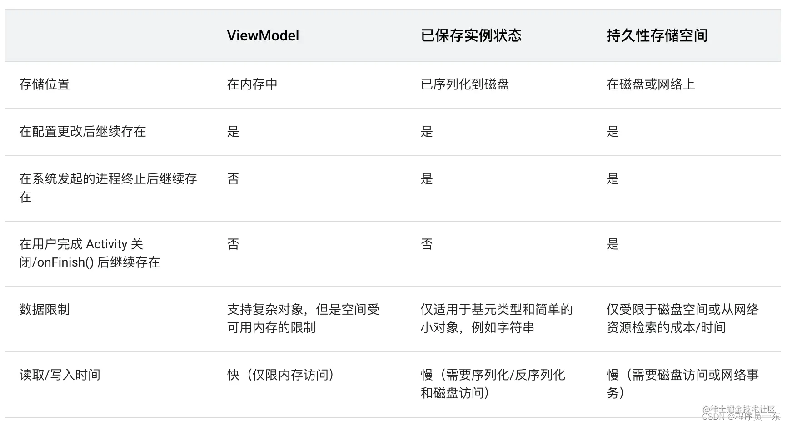

### Activity

#### activity 生命周期

- 1. onCreat()
- 2. onStart()
- 3. onResume()
- 4. onPaue()
- 5. onStop()
- 6. onResttart()
- 7. onDestory()

#### A-->B 生命周期

1.Activity1 启动：
Activity1: onCreate()-> onStart() -> ->onResume()

2.点击按钮跳转到 Activity2:
Activity1: onPause()
Activity2: onCreate() -> onStart() -> onResume()
Activity1: onStop()

3.从 Activity2 中返回：
Activity2: onPause()
Activity1: onRestart() -> onStart() ->onResume()
Activity2: onStop() -> onDestroy()

4.Activity1 退出
Activity1: onPause() ->onStop()->onDestroy()

#### Activity A 启动另一个Activity B ,B是透明主题的又或则是个DialogActivity呢
A不会onStop()

#### onSaveInstanceState(), onRestoreInstanceState 和 onNewIntent 这三个方法的作用区别如下:
-   onSaveInstanceState(): 当Activity可能被销毁时调用,用于保存状态数据。调用时机在onPause()或onStop()之后。
-   onRestoreInstanceState(): 当Activity被重建时调用,用于恢复onSaveInstanceState()中保存的状态数据,以便Activity恢复到销毁前的状态。
-   onNewIntent(): 当Activity正在运行时,如果又重新发送了新的Intent到该Activity,会调用这个方法。通常用于重新初始化Activity,使其进入适合新的Intent的状态。

#### 切换横竖屏时Activity的生命周期?
竖屏：onCreat->onStart->onResume.
切换横屏时：onPause-> onSaveInstanceState ->onStop->onDestory

onCreat->onStart->onSaveInstanceState->onResume.

但是，我们在如果配置这个属性:android:configChanges="orientation|keyboardHidden|screenSize"
就不会在调用Activity的生命周期，只会调用onConfigurationChanged方法


#### 启动模式

-   standard（标准模式）：
每次启动 Activity 都会创建一个新的实例，并放置在调用它的任务栈的顶部。
-   singleTop（单顶部模式）：
如果新启动的 Activity 已经位于任务栈的顶部，那么不会创建新的实例，而是调用已存在的实例的 onNewIntent 方法；如果不在顶部，则会创建新的实例。
-   singleTask（单任务模式）：
在同一个任务栈中只能存在一个该 Activity 的实例。如果已经存在实例，则会将任务栈上该实例以上的所有 Activity 移除，使其处于栈顶，并调用其 onNewIntent 方法。如果不存在实例，则会创建一个新的实例。
-   singleInstance（单实例模式）：

该模式下的 Activity 是独立于其他任务栈的，会单独位于一个新的任务栈中，并且系统不会在该任务栈中放置任何其他 Activity。如果已经存在实例，则会调用其 onNewIntent 方法，而不会创建新的实例。
#### 数据保存和恢复

    开发者提前可以复写onSaveInstanceState方法，创建一个Bundle类型的参数，
    把数据存储在这个Bundle对象中，这样即使Activity意外退出
    ，Activity被系统摧毁，当重新启动这个Activity而调用onCreate方法时，上述Bundle对象会作为参数传递给onCreate方法，开发者可以从Bundle对象中取出保存的数据，利用这些数据将Activity恢复到被摧毁之前的状态。

#### Activity之间传递数据的方式Intent是否有大小限制，如果传递的数据量偏大，有哪些方案
在Android中，Intent传递数据是有大小限制的，主要取决于系统的限制。对于普通的数据传递，Intent的数据大小通常被限制在几百KB到几MB之间。当你尝试传递大量数据时，可能会遇到TransactionTooLargeException异常。

为了解决这个问题，你可以考虑以下方案：

-   使用Bundle分割数据：将大数据拆分成小块，分别放入多个Intent中传递，然后在接收端重新组装数据。

-   使用文件存储：将数据写入文件，然后在Intent中传递文件路径，接收端再读取文件内容。这种方法适用于大型数据或者需要持久化的数据。

-   使用共享存储：将数据存储在共享的地方，比如ContentProvider或者SharedPreferences，然后在Intent中传递标识符或者URI。

-  使用单例模式：如果数据是需要在应用内共享的，可以考虑使用单例模式来保存数据，这样不需要通过Intent传递数据，不会受到大小限制的限制。

- 使用服务（Service）：可以使用Service在后台处理大数据，然后通过其他方式通知UI组件或者其他组件。

#### 显示/隐式启动意图
显示启动(Explicit Intent)和隐式启动(Implicit Intent)是启动Android Activity的两种主要方式,区别如下:

显示启动:
- 直接通过组件名(完整类名)启动目标Activity
- Intent指定目标Activity组件名,使用setComponent()、setClass()或setClassName()设置
- 不需要过滤器,直接启动指定的Activity,比如:
```
        Intent intent = new Intent(this, TargetActivity.class);
        startActivity(intent);  
```
隐式启动:
- 通过Intent action、category、data等信息启动符合过滤条件的目标Activity
- 不指定目标Activity,系统根据Intent的信息匹配符合的Activity
- 需要在AndroidManifest.xml中通过<intent-filter>为目标Activity设置过滤条件
- 例如启动查看地图的Activity:
        Intent intent = new Intent(Intent.ACTION_VIEW); 
        intent.setData(Uri.parse("geo:38.899533,-77.036476"));
        startActivity(intent);  

区别:
- 显示启动直接定向到目标Activity,隐式启动系统匹配最合适的Activity
- 显示启动只能启动指定的Activity,隐式启动可以启动不同实现的Activity
- 显示启动更简单直接,隐式启动更灵活
所以,显示启动用于直接启动确定已知的Activity,隐式启动用于启动未确定但符合条件的Activity。


#### 
scheme是一种通过自定义URI方案来调用App功能的方式,其使用场景和细节如下:

使用场景:
- 从网页或其他App跳转到自己App的指定界面
- 实现App间跳转和数据传递 
- 分享内容到自己App
- App内部功能调度

协议格式:
- scheme://host/path
- scheme是自定义协议名,host通常为包名,path表示路由路径

使用方式: 
1. 在AndroidManifest.xml注册scheme和intent-filter
2. 构建自定义scheme的Intent 
3. 调用startActivity()打开Intent

例如在AndroidManifest.xml中注册:
```JAVA
    <activity android:name=".MainActivity">
    <intent-filter>
        <action android:name="android.intent.action.VIEW" />
        <category android:name="android.intent.category.DEFAULT" />
        <category android:name="android.intent.category.BROWSABLE" />
        <data android:scheme="myapp" android:host="MainActivity" />
    </intent-filter>
    </activity>
```

然后在需要打开MainActivity时构造Intent:
```JAVA
    Intent intent = new Intent(Intent.ACTION_VIEW);
    intent.setData(Uri.parse("myapp://MainActivity"));
    startActivity(intent);
```

所以scheme适合用于App内跨组件功能访问以及App之间灵活跳转。

#### ANR 的四种场景

ANR(Application Not Responding) 即应用无响应,会导致界面卡顿甚至白屏,常见的四种ANR场景:

1. 主线程执行阻塞操作导致卡顿。
2. 广播接收者在10秒内无法处理完成。 
3. 服务在20秒内未启动完成。
4. ContentProvider在10秒内无法处理完成。

#### onCreate和onRestoreInstance方法中恢复数据时的区别
onCreate()和onRestoreInstanceState()这两个方法都可以用于在Activity重新创建时恢复数据状态,它们的主要区别是:

1. 调用时机不同
- onCreate(): 每次Activity创建时都会调用,无论是否有保存的状态。
- onRestoreInstanceState(): 仅当Activity被重建并且存在保存的状态时才会被调用。

2. 数据来源不同  
- onCreate(): 通过Intent extras 和默认值获取数据。
- onRestoreInstanceState(): 通过onSaveInstanceState()保存并传递过来的Bundle获取数据。

3. 使用场景不同
- onCreate(): 初始化新的Activity实例,获取启动参数。
- onRestoreInstanceState(): 恢复之前实例的临时状态,使重建的Activity连贯。

4. 重建状态不同 
- onCreate(): 完全新的Activity实例,无任何之前状态。
- onRestoreInstanceState(): 重建的实例,需要恢复到保存前的状态。


#### Activity的数据是怎么保存的,进程被Kill后,保存的数据怎么恢复的

- 保存和恢复实例状态
- 持久化存储


#### 为什么 Activity 在屏幕旋转重建后可以恢复 ViewModel？

ViewModel 底层是基于原生 Activity 因设备配置变更重建时恢复数据的机制实现的，这个其实跟 Fragment#setRetainInstance(true) 持久 Fragment 的机制是相同的。当 Activity 因配置变更而重建时，我们可以将页面上的数据或状态可以定义为 2 类：

第 1 类 - 配置数据： 例如窗口大小、多语言字符、多主题资源等，当设备配置变更时，需要根据最新的配置重新读取新的数据，因此这部分数据在配置变更后便失去意义，自然也就没有存在的价值；
第 2 类 - 非配置数据： 例如用户信息、视频播放信息、异步任务等非配置相关数据，这些数据跟设备配置没有一点关系，如果在重建 Activity 的过程中丢失，不仅没有必要，而且会损失用户体验（无法快速恢复页面数据，或者丢失页面进度）。
基于以上考虑，Activity 是支持在设备配置变更重建时恢复 第 2 类 - 非配置数据 的，源码中存在 NonConfiguration 字眼的代码，就是与这个机制相关的代码。我将整个过程大概可以概括为 3 个阶段：

阶段 1： 系统在处理 Activity 因配置变更而重建时，会先调用 retainNonConfigurationInstances 获取旧 Activity 中的数据，其中包含 ViewModelStore 实例，而这一份数据会临时存储在当前 Activity 的 ActivityClientRecord（属于当前进程，下文说明）；
阶段 2： 在新 Activity 重建后，系统通过在 Activity#onAttach(…) 中将这一份数据传递到新的 Activity 中；
阶段 3： Activity 在构造 ViewModelStore 时，会优先从旧 Activity 传递过来的这份数据中获取，为空才会创建新的 ViewModelStore。
对于 ViewModel 来说，相当于旧 Activity 中所有的 ViewModel 映射表被透明地传递到重建后新的 Activity 中，这就实现了恢复 ViewModel 的功能。总结一下重建前后的实例变化，帮助你理解:

Activity： 构造新的实例；
ViewModelStore： 保留旧的实例；
ViewModel： 保留旧的实例（因为 ViewModel 存储在 ViewModelStore 映射表中）；
LiveData： 保留旧的实例（因为 LiveData 是 ViewModel 的成员变量）；


#### Acitivity 得启动流程
-   Launcher发送启动Intent  
点击图标后,Launcher会创建一个启动目标App的Intent,并调用startActivity()。

-  ActivityManagerService接收到启动请求  
AMS会接收到启动Intent,检查Intent信息并创建一个新的ActivityRecord对象。

-  ActivityManagerService启动进程  
如果App进程不存在,AMS会向Zygote进程发送创建进程的请求。

-  Zygote初始化进程  
Zygote收到请求后会fork出新的进程,在新进程中启动SystemServer。

-  SystemServer启动相关服务  
SystemServer会启动ActivityManagerService、WindowManagerService等系统服务。

-  ActivityManagerService创建首个Activity  
AMS根据Intent信息,通过ApplicationThread向进程发送创建Activity请求。

-  应用进程创建Activity  
应用进程收到请求后,在主线程中创建目标Activity,并回调onCreate()等方法。

-  Activity创建窗口  
Activity在onResume()时会添加窗口并绘制UI界面。


####  ViewModel 的数据在什么时候才会清除
ViewModel 的数据会在 Activity 非配置变更触发的销毁时清除，具体分为 3 种情况：

 直接调用 Activity#finish() 或返回键等间接方式；  
 异常退出 Activity，例如内存不足；  
强制退出应用  

#### ViewModel 和 onSaveInstanceState() 的对比
-   1、ViewModel： 使用场景针对于配置变更重建中非配置数据的恢复，由于内存是可以满足这种存储需求的，因此可以选择内存存储。又由于内存空间相对较大，因此可以存储大数据，但会受到内存空间限制；
-   2、onSaveInstanceState() ：使用场景针对于应用被系统回收后重建时对数据的恢复，由于应用进程在这个过程中会消亡，因此不能选择内存存储而只能选择使用持久化存储。又由于这部分数据需要通过 Bundle 机制在应用进程和 AMS 服务之间传递，因此会受到 Binder 事务缓冲区大小限制，只可以存储小规模数据。




### Service
#### 启动方式 和区别
Service的生命周期和两种启动方式的主要区别:
生命周期:
- onCreate():服务第一次创建时调用
- onStartCommand(): 每次启动服务时调用
- onDestroy():服务销毁前调用
- onBind():服务被绑定时调用  
- onUnbind(): 服务被解绑时调用

两种启动方式:
1. startService:
- 调用Context的startService()
- 服务会一直运行,不会被销毁,除非手动停止或内存不足。
- 适合启动后需要长期运行的服务。  
2. bindService:
- 调用Context的bindService()
- 依赖于调用服务的客户端生命周期,客户端销毁则服务将销毁。
- 用于客户端需要和服务交互的情况。

区别:

- startService可以长期在后台运行,bindService生命周期依赖客户端。
- startService适合独立的后台服务,bindService适合客户端需要交互的服务。
- onStartCommand对应startService,onBind对应bindService。

#### 服务保活
保证Service不被系统杀死的常用方法有:

1. 开启前台Service
2. 通过startService启动
3. 重写onStartCommand()
在onStartCommand()中返回START_STICKY,如果Service被杀死可以重启。

4. 成为进程的主线程
可以在AndroidManifest中为Service设置android:process=":main",使其运行在主进程中,作为主线程不会被随意销毁。
5. 系统自动重启 在服务中增加自重启机制

6. 提高服务优先级
7. 与用户交互
定期通过Notification和用户交互,用户正在使用的服务系统不会轻易杀死。
8. 加入白名单

#### Service 如何通信
1. BroadCastReceiver
2. EventBus
3. Callback
5. AIDL
定义AIDL接口,Service和Activity分别实现,可以跨进程通信。
6. SharedPreferences
7.数据库 
8. 文件

#### IntentService是什么,IntentService原理，应用场景及其与Service的区别
IntentService是Android提供的一种特殊的Service，用于在后台执行异步任务。它继承自Service类，并且通过队列的方式处理来自主线程的Intent请求。IntentService在处理完所有的Intent请求后会自动停止，因此不需要手动调用stopSelf()方法来停止Service。

**工作原理**：
1. 当Activity或其他组件调用startService()方法启动IntentService时，IntentService会创建一个工作线程（HandlerThread），并在该线程上依次处理每个Intent请求。
2. 在IntentService的onHandleIntent()方法中，处理传递过来的Intent对象，执行需要在后台完成的任务。
3. 处理完一个Intent请求后，IntentService会停止并销毁自身。

**应用场景**：
1. 执行短暂的、耗时较少的后台任务，比如下载文件、上传数据、处理数据等。
2. 在不需要与用户交互的情况下执行后台任务，比如接收推送消息后执行相关处理。
3. 需要按顺序处理多个后台任务，且确保所有任务都会被处理到。

**与普通Service的区别**：
1. **生命周期管理**：IntentService在处理完所有的Intent请求后会自动停止并销毁，而普通的Service需要手动调用stopSelf()或stopService()方法来停止。
2. **线程管理**：IntentService内部已经实现了一个工作线程，因此不需要手动管理线程。而普通的Service需要手动创建线程来执行后台任务。
3. **任务队列**：IntentService会按顺序处理传递过来的Intent请求，而普通的Service则需要自行管理任务的队列。
4. **并发处理**：IntentService处理Intent请求是在单个工作线程中依次执行的，因此不存在并发执行的情况。而普通的Service可以手动创建多个线程来实现并发处理。

#### Service 的 onStartCommand 方法有几种返回值?各代表什么意思?

在Service的onStartCommand()方法中，有三种返回值，分别是：
1. **START_NOT_STICKY**：表示Service被系统销毁后，不会重新启动Service。即使还有未处理的Intent请求，系统也不会尝试重新启动Service。适用于执行一次性任务的Service。

2. **START_STICKY**：表示Service被系统销毁后，会尝试重新启动Service，并重新传递最后一个Intent请求给Service。但是不会重新传递之前的未处理的Intent请求。适用于需要保持长期运行的Service，比如播放音乐的后台服务。

3. **START_REDELIVER_INTENT**：表示Service被系统销毁后，会尝试重新启动Service，并重新传递所有未处理的Intent请求给Service。适用于需要确保所有Intent请求都被处理的情况，比如下载文件的后台服务。

这些返回值决定了Service在被系统销毁后的重新启动行为，根据不同的需求选择合适的返回值来确保Service的行为符合预期。

#### 用过哪些系统服务
1. **ActivityManagerService**：负责管理Activity的生命周期、进程管理、任务栈管理等。

2. **PackageManagerService**：负责管理应用程序包，包括安装、卸载、权限管理等。

3. **WindowManagerService**：负责管理窗口、布局、Surface等窗口相关的操作。

4. **NotificationManagerService**：负责管理通知，包括发送通知、取消通知、通知栏管理等。

5. **AlarmManagerService**：负责管理定时任务、闹钟等，用于在指定时间触发特定的操作。

6. **TelephonyManagerService**：负责管理电话相关的操作，比如拨号、接听电话、发送短信等。

7. **WifiManagerService**：负责管理Wi-Fi网络连接，包括搜索可用的Wi-Fi网络、连接指定的Wi-Fi网络等。

8. **BluetoothManagerService**：负责管理蓝牙连接和通信。

9. **PowerManagerService**：负责管理设备的电源管理，包括休眠模式、唤醒锁等。

10. **LocationManagerService**：负责管理设备的位置信息，包括GPS定位、网络定位等。

这些系统Service提供了Android系统的核心功能，并且可以通过系统API与应用程序进行交互，从而实现各种功能和服务。

#### Service如何进行保活
利用系统广播拉活
利用系统service拉活
利用Native进程拉活<Android5.0以后失效> fork进行监控主进程，利用native拉活
利用JobScheduler机制拉活<Android5.0以后>

### ContentProvider


### AMS

#### AMS作用
ActivityManagerService的主要职责包括：
1. Activity生命周期管理：负责管理应用程序中活动的创建、销毁和状态转换（如暂停、恢复、停止和重新启动）。
2. 进程管理：监督应用程序运行的进程的创建、终止和管理。这包括在不同进程之间分配系统资源（如内存和CPU使用）。
3. 任务堆叠：维护每个应用程序的任务（活动）堆栈，并管理任务后退堆栈，确定用户在不同屏幕之间导航时活动显示的顺序。
4. 进程间通信（IPC）：通过意图（intents）、内容提供者（content providers）和绑定服务（bound services）等机制，促进不同应用程序和进程之间的通信。
5. 内存管理：监控应用程序的内存使用情况，并确保有效地分配和释放内存，以防止因内存耗尽而导致系统减速或崩溃。
6. 应用程序启动和切换：处理应用程序的启动和切换，确保用户体验流畅，同时有效地管理系统资源。